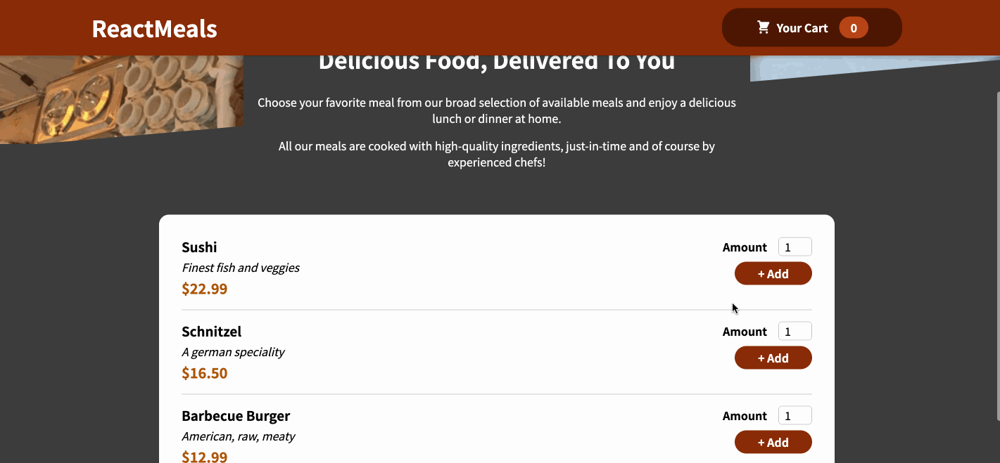

<h1>Site de pedido de comida 🍔🍕</h1>

<a href="https://github.com/dieegomr/food-order-app/blob/main/README.md">README.md</a> in english

Trata-se de um site de pedido de comida onde tem uma lista de refeições entre as quais o utilizador pode escolher e depois pode adicionar essas refeições ao carrinho e posteriormente modificar o carrinho adicionando mais pratos ou alterando a quantidade.

O aplicativo de pedidos de comida faz parte do <a href="https://www.udemy.com/share/101Way3@Tl-LkQQtUAOqtTxMOnWfVxtvmAXWum0zMXkgJeQeEA3ZxE_NFZ1NpKMcjaQF9vuqrQ==/">"React - O Guia Completo (incluindo Hooks, React Router, Redux )
"</a>.

Foi possível praticar componentes, React Hooks, renderizar listas e conteúdo condicional, requisição de dados via Http(usei Firebase como back end), ler valores de formulários, validação de formulários e muito mais.

O HTML e o CSS estavam prontos, mas foi necessário implementar o código JSX para que o site funcionasse corretamente. 

<h3>Amostra:</h3>

<h3>Como rodar esta aplicação no seu pc?</h3>

 1) Clone o repositório 

 $ git clone https://github.com/dieegomr/food-order-app.git

 2) Abra a pasta do projeto no terminal e execute os seguintes comandos

   2.1) $ npm install

   2.2) $ npm start

 3) Verifique a mensagem: "O servidor será executado em http://localhost:XXXX"

 4) Copie e cole o link no seu navegador caso a página não tenha aberto automaticamente

